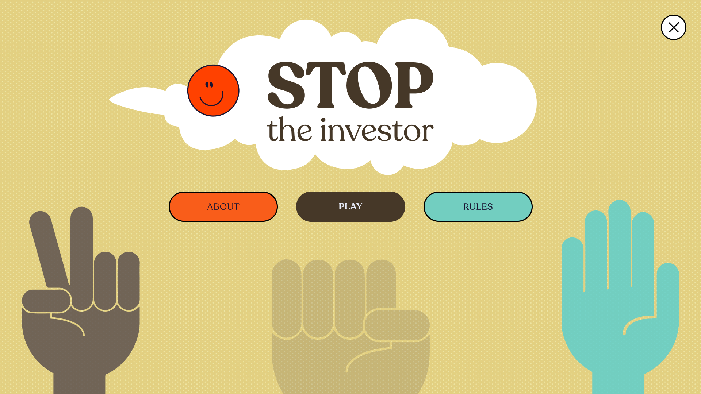
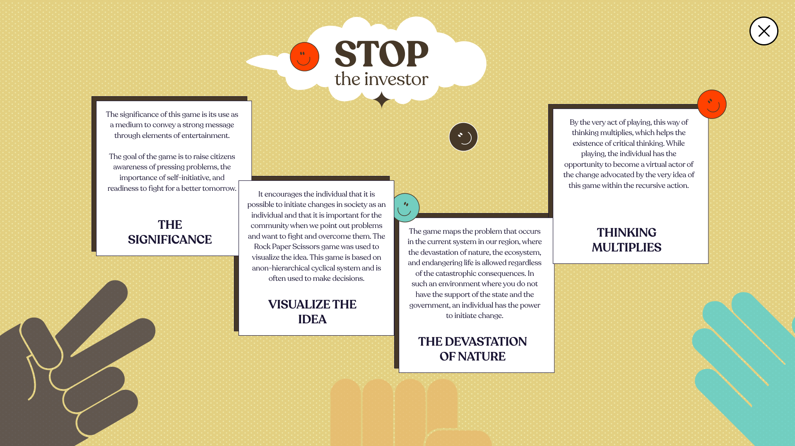
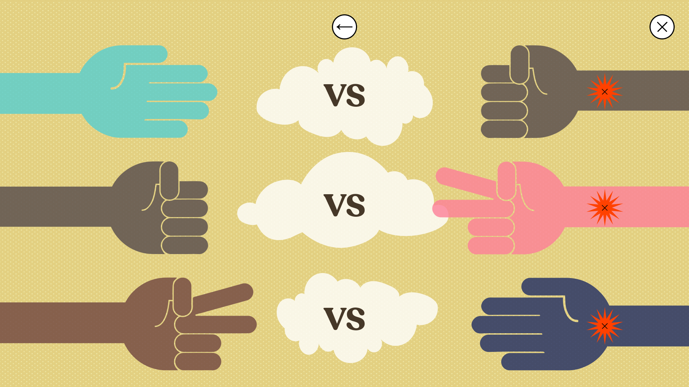
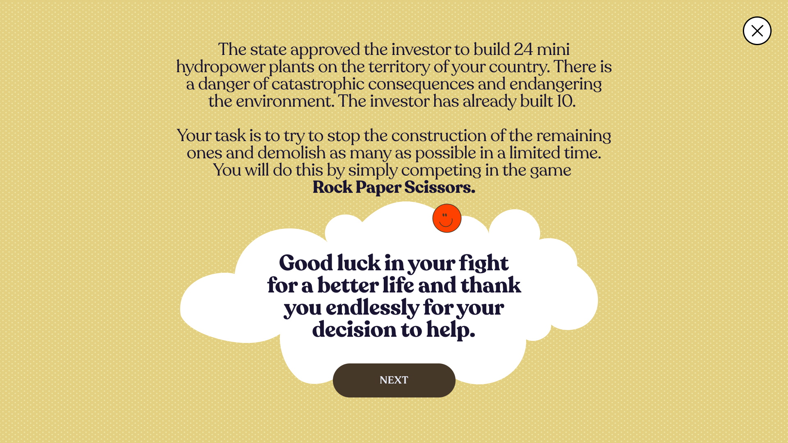
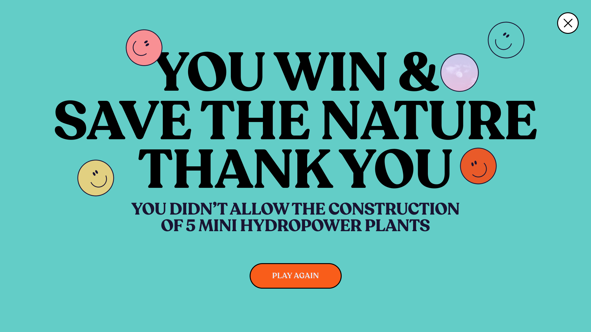
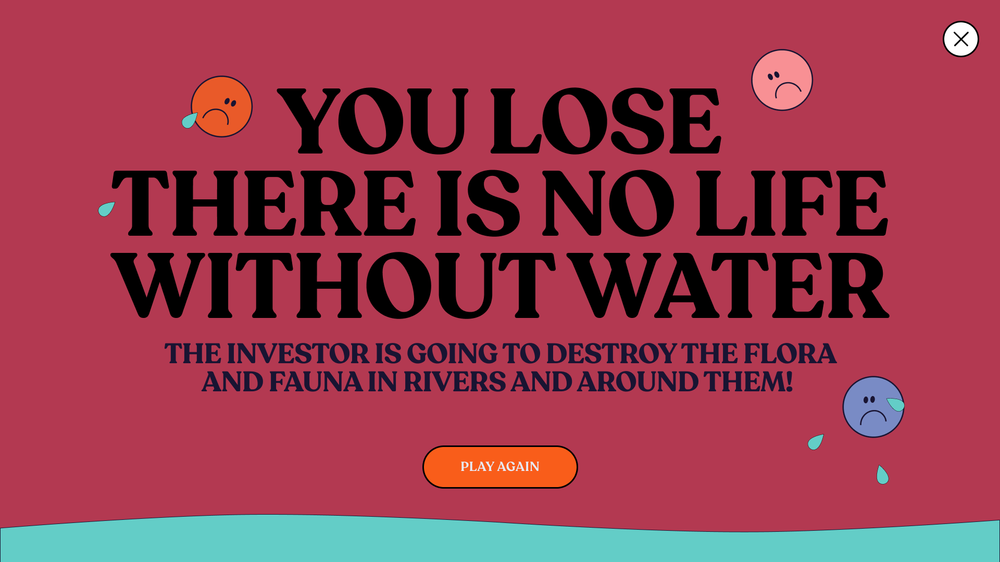

# Stop the Investor

Stop the Investor is a 1 player game(user vs computer)

## About the game
The state approved the investor to build 24 mini hydropower plants on the territory of your country. There is a danger of catastrophic consequences and endangering the environment. The investor has already built 10.
Your task is to try to stop the construction of the remaining ones and demolish as many as possible in a limited time. You will do this by simply competing in the game Rock Paper Scissors.

The significance of this game is its use as a medium to convey a strong message through elements of entertainment.
The goal of the game is to raise citizens awareness of pressing problems, the importance of self-initiative, and readiness to fight for a better tomorrow.
It encourages the individual that it is possible to initiate changes in society as an individual and that it is important for the community when we point out problems and want to fight and overcome them.
The Rock Paper Scissors game was used to visualize the idea. This game is based on a non-hierarchical cyclical system and is often used to make decisions.
The game maps the problem that occurs in the current system in our region, where the devastation of nature, the ecosystem, and endangering life is allowed regardless of the catastrophic consequences. In such an environment where you do not have the support of the state and the government, an individual has the power to initiate change.
By the very act of playing, this way of thinking multiplies, which helps the existence of critical thinking. While playing, the individual has the opportunity to become a virtual actor of the change advocated by the very idea of this game within the recursive action.

## Game compatibility

#### Designed properly just for

* desktop Google Chrome browser
* 1920 x 1080 screen resolution

### Technologies used
* HTML5
* CSS3
* JavaScript

## UI/UX Design
In the beginning, I was researching on the internet for solutions for some kind of UI/UX Design for my game, and none of the solutions was good enough for me to use for implementation. So, I take this opportunity to make my own UI/UX Design and not follow current practices that you can see on the internet.

main

about

rules

before battle

battle

win

lose

